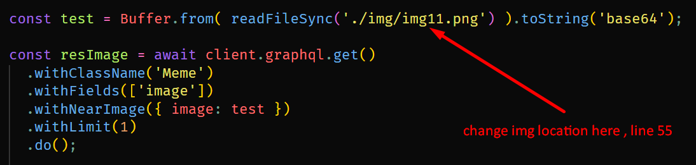

## Weaviate client vector db project . 
this is a simple project based to [weaviate's](https://weaviate.io) vector database feature . 


## how to try this project out ,  
this project assumes that you already know about and have installed  docker and node , these are the only two things you need to run the project . 

### Install links : 
1. [docker desktop](https://www.docker.com/products/docker-desktop/)
2. [node.js LTS install](https://nodejs.org/en) , install LTS version . 


### Steps after installing docker & node  >>> 
1. Clone the repo . 
2. run ```npm i``` 
3. run ``` docker-compose up -d``` 
4. the project assumes you know a little bit of programming , change the image location to your liking and then check the results image for the most resembling image from the folder . 
5. then run ```node app.js``` 




